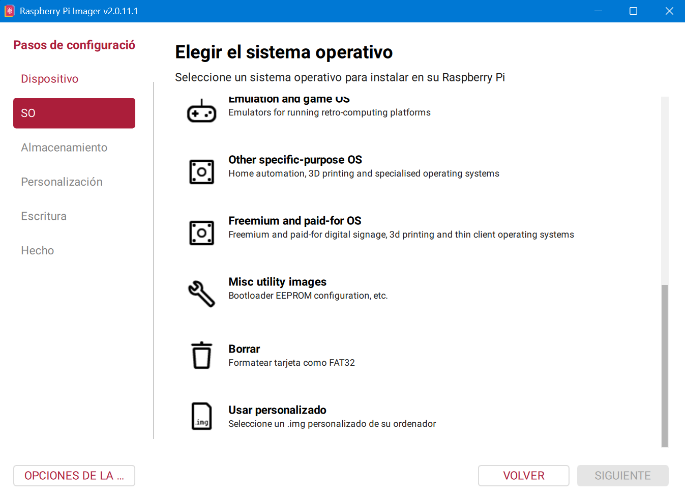
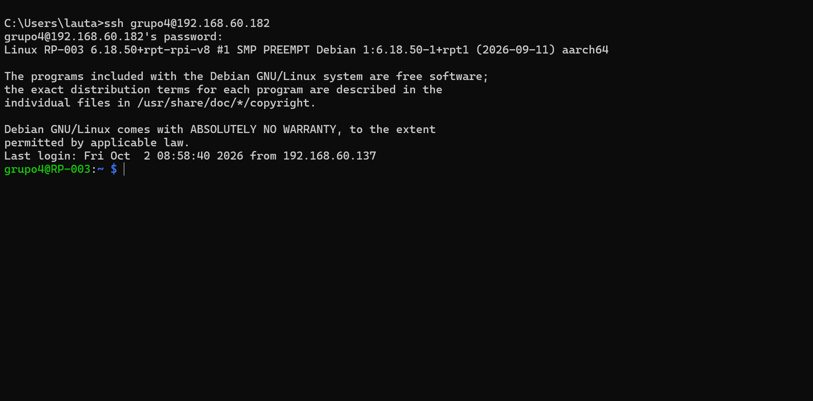
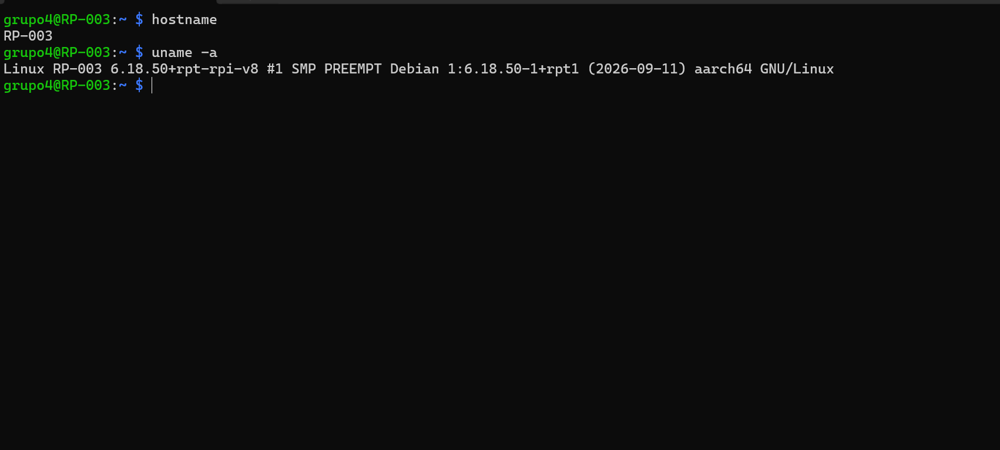

# Instalación de Raspberry Pi OS Lite y configuración de SSH

**Materia:** Telecomunicaciones
**Trabajo Integrador**
**Integrantes:** Alladio - Conejero - Corti - Ferrazzuolo - Manfredini

---

## Índice

1. [Introducción](#1-introducción)
2. [Objetivo del informe](#2-objetivo-del-informe)
3. [Desarrollo teórico](#3-desarrollo-teórico)
4. [Instalación del sistema operativo](#4-instalación-del-sistema-operativo)
5. [Configuración de SSH](#5-configuración-de-ssh)
6. [Conexión remota mediante SSH](#6-conexión-remota-mediante-ssh)
7. [Explicación de los comandos](#7-explicación-de-los-comandos)
8. [Pruebas de funcionamiento](#8-pruebas-de-funcionamiento)
9. [Conclusión](#9-conclusión)
10. [Bibliografía y fuentes consultadas](#10-bibliografía-y-fuentes-consultadas)

---

## 1. Introducción

En este informe preparamos una Raspberry Pi para usarla más adelante como servidor dentro de una red local. Para eso instalamos desde cero un sistema operativo sin entorno de escritorio y configuramos SSH, que nos permite administrarla desde otra computadora.

---

## 2. Objetivo del informe

- Instalar Raspberry Pi OS Lite en una tarjeta microSD.
- Habilitar y comprobar el servicio SSH.
- Conectarnos de forma remota a la Raspberry Pi y verificar que funciona.

---

## 3. Desarrollo teórico

### 3.1. Raspberry Pi

Es una computadora de tamaño reducido y bajo costo que puede ejecutar un sistema operativo y distintos servicios. En una red se puede usar, por ejemplo, como servidor web, de archivos o DNS.

### 3.2. Raspberry Pi OS Lite

Es la versión del sistema operativo oficial de Raspberry Pi que no incluye entorno gráfico de escritorio. La elegimos porque la Raspberry va a funcionar como servidor, y en un servidor la mayoría de las tareas se hacen desde la terminal. Además, al no tener escritorio consume menos recursos y deja más memoria y procesador para los servicios que vamos a instalar.

### 3.3. SSH

SSH (*Secure Shell*) es un protocolo que permite conectarse a otro equipo por la red y usar su terminal como si estuviéramos adelante de él. La comunicación va cifrada, por lo que lo que se envía entre los dos equipos está protegido.

En nuestro caso:

- La Raspberry Pi es el **servidor SSH**.
- La computadora desde la que nos conectamos es el **cliente SSH**.

```text
Computadora (cliente) → Red local → Raspberry Pi (servidor)
```

---

## 4. Instalación del sistema operativo

### 4.1. Raspberry Pi Imager

Usamos **Raspberry Pi Imager**, la herramienta oficial para descargar el sistema operativo y escribirlo en una tarjeta microSD. La descargamos e instalamos en una computadora, colocamos la tarjeta microSD y abrimos el programa.



Seleccionamos el modelo de Raspberry Pi y como sistema operativo **Raspberry Pi OS Lite (64-bit)**.

### 4.2. Configuración inicial

Antes de escribir la tarjeta, configuramos los parámetros iniciales:

- Nombre del dispositivo.
- Nombre de usuario.
- Contraseña.
- Configuración de red, en caso de ser necesaria.
- Zona horaria.
- Habilitación del servicio SSH.

Con esto, al iniciar, la Raspberry Pi puede conectarse a la red y ser administrada de forma remota.


### 4.3. Escritura del sistema operativo

Con todo seleccionado, iniciamos la escritura. El Imager descarga el sistema y lo graba en la microSD. Este proceso borra todo lo que tenía la tarjeta, así que hay que fijarse bien que se eligió el dispositivo correcto. Al terminar, sacamos la tarjeta de forma segura y la pusimos en la Raspberry Pi.


---

## 5. Configuración de SSH
    
### 5.1. Verificar que el servicio está activo

SSH ya lo habilitamos desde el Imager, pero igual lo comprobamos desde la terminal:

```bash
sudo systemctl status ssh
```

Si está funcionando, aparece algo como:

```text
Active: active (running)
```


### 5.2. Dirección IP de la Raspberry Pi

Para conectarnos necesitamos saber qué IP tiene la Raspberry en la red local:

```bash
hostname -I
```

Nos mostró la sigiente dirección IP

```text
192.168.60.182
```

No se adjuntó la captura de la dirección IP de la Raspberry Pi.

## 6. Conexión remota mediante SSH

Desde otra computadora conectada a la misma red usamos:

```bash
ssh grupo4@192.168.60.182
```



## 7. Explicación de los comandos

### `sudo systemctl status ssh`

- `sudo`: ejecuta el comando con permisos de administrador.
- `systemctl`: herramienta para manejar los servicios del sistema.
- `status`: pide el estado actual del servicio.
- `ssh`: el servicio que queremos consultar.

Sirve para ver si el servidor SSH está corriendo y listo para recibir conexiones.

### `hostname -I`

- `hostname`: muestra o modifica el nombre del equipo.
- `-I`: con esta opción muestra las direcciones IP del equipo.

Lo usamos para saber a qué IP conectarnos.

### `ssh usuario@IP`

- `ssh`: el cliente que inicia la conexión remota.
- `usuario`: el usuario de la Raspberry con el que queremos entrar.
- `@`: separa el usuario de la dirección.
- `IP`: la dirección de la Raspberry en la red.

### `hostname`

Muestra el nombre del equipo. Lo usamos para comprobar que estamos dentro de la Raspberry y no en nuestra computadora.

### `uname -a`

- `uname`: muestra información del sistema.
- `-a` (*all*): muestra toda la información disponible (nombre del equipo, versión del kernel, arquitectura, etc.).

## 8. Pruebas de funcionamiento

Una vez conectados por SSH ejecutamos estos comandos:

```bash
hostname
uname -a
```

El primero mostró el nombre que le pusimos a la Raspberry y el segundo la información de su sistema y kernel. Así comprobamos que, aunque escribíamos los comandos desde otra computadora, se ejecutaban en la Raspberry Pi.



## 9. Conclusión

Instalamos Raspberry Pi OS Lite en la Raspberry Pi, habilitamos SSH, averiguamos su IP y nos conectamos desde otra computadora, comprobando que podíamos usarla de forma remota. Con esto la Raspberry queda lista para instalar servicios de red, y SSH nos permite hacerlo sin monitor ni teclado: instalar programas, editar archivos de configuración y controlar servicios.

## 10. Bibliografía y fuentes consultadas

- Raspberry Pi, sitio oficial: https://www.raspberrypi.org/
- Raspberry Pi, documentación oficial: https://www.raspberrypi.com/documentation/
- IONOS, información sobre la configuración de SSH en Raspberry Pi.
- Material audiovisual sobre SSH proporcionado por el docente.